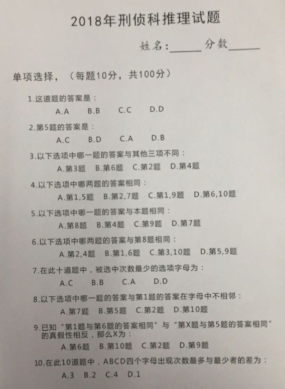

# criminal-investigation-2018
## 2018年刑侦科推理试题

***
``` prolog
?- query(Ans)
```
源代码：[query.pl](./query.pl)

在 [swish](https://swish.swi-prolog.org) 中测试通过。

***
### 其它语言版本
(字母序)
* [C#](https://www.zhihu.com/question/68411978/answer/332337808)
* [F#](https://www.zhihu.com/question/68411978/answer/332363865)
* [Haskell](https://www.zhihu.com/question/68411978/answer/332459717)
* [Prolog](https://www.zhihu.com/question/68411978/answer/332545899)
* [Python](https://github.com/YuyuZha0/abcd_test)
* [Python](https://www.zhihu.com/question/68411978/answers/created)
* [Visual Basic](https://www.zhihu.com/question/68411978/answer/331923520)

***
### 原题目

